# Signing the Unsigned: Robust Surfact Reconstruction from Raw Pointsets

**Authors:** Anqi (Joyce) Yang and Jonah Philion

**Project:** This repository implements
[Signing the Unsigned: Robust Surfact Reconstruction from Raw Pointsets](https://hal.inria.fr/inria-00502473/document)
by Mullen et al. 2010.

**Challenge:** Extract a signed distance field (SDF) given only a raw pointcloud.

**Proposed Solution:** This paper leverages the fact that, given a closed surface , a query point  can be classified as lying inside or outside the surface by shooting a ray in any direction from the query point and counting how many times the ray intersections the surface ; if the ray intersects the surface an even/odd number of times, the point is outside/inside the surface. The paper uses this fact to "sign" an unsigned distance field. The steps are:

	1. calculate an unsigned distance field (UDF)
	2. recover a coarse mesh (M) from the UDF
    3. use M to find an epsilon-band that best captures the surface boundary
	4. shoot rays through the epsilon-band to sign the UDF relative to M
	5. smooth the signed distance

**Takeaways:** Our main critique of this paper is that it has a chicken-and-the-egg problem; ray-shooting only returns reasonable estimates of the sign if the coarse mesh M is good, but if the coarse mesh M is good then the performance benefit of estimating the sign will be small. We find that the algorithm is very sensitive to its many hyper-parameters, a problem that follow-up work to this paper attempts to address ([Noise-Adaptive Shape Reconstruction from Raw Point Sets](http://citeseerx.ist.psu.edu/viewdoc/download?doi=10.1.1.679.2055&rep=rep1&type=pdf)). 

## Our Implementation

> **To get started:** Clone this repository recursively
> 
>     git clone --recursive http://github.com/ajyang99/geometry-processing-signing-the-unsigned.git
>

## Installation and Compilation

We use `CGAL` for 3D Delaunay triangulation. `CGAL` requires `gmp`, `mpfr` and `boost`.
If you are a Linux user, run

    sudo apt-get install libgmp3-dev libmpfr-dev libboost-all-dev
If you are a Mac user, run

    brew install gmp mpfr boost

If you are a Windows user,
you will only need to install `boost` as the makefiles below should
download and install the other two for you automatically.

To build the project, run

    mkdir build
    cd build
    cmake -DLIBIGL_WITH_CGAL=ON -DCMAKE_BUILD_TYPE=Release ../
    make

## Execution

Once built, you can execute the assignment from inside the `build/` using 

    ./mesh-reconstruction [path to point cloud]

## Visualization
#### Mesh Visualization
* `S` / `s` - mesh output by "Signing the Unsigned"
* `C` / `c` - intermediate coarse mesh output by "Signing the Unsigned"
* `E` / `e` - epsilon-band output by "Signing the Unsigned"
* `N` / `n` - mesh output by Poisson Surface Reconstruction
#### Ray Shooting
* `e` - sample a ray and visualize the result
#### Point Cloud Visualization
* `w` - input point cloud
* `P` / `p` - coarse mesh vertices colored based on which switch is selected below
* `y` - color according to predicted signed distance
* `u` - color according to predicted sign
* `i` - color according to sign confidence
* `o` - color according to unsigned distance
* `m` - color according to poisson distance
* `b` - show gradient of the unsigned distance (used during ray-shooting)
#### 2D Cut
* `r`- visualize a 2D cut and increment the 2D cut being visualized
* `t` - visualize a 2D cut and decrement the 2D cut being visualized

## Background
We implement the [Signing the Unsigned: Robust Surfact Reconstruction from Raw Pointsets](https://hal.inria.fr/inria-00502473/document) by Mullen et al. 2010. The goal is to robustly reconstruct a closed, watertight mesh from a set of (potentially noisy) points. Unlike
Poisson Surface Reconstruction by Kazhdan et al. 2006, this algoithm does not require
oriented normals as input. At a high level, the algorithm estimates an unsigned
distance field, and signs it with ray shooting. Remember that the
[signed distance](https://en.wikipedia.org/wiki/Signed_distance_function) of
an arbitrary point  to a solid volume  with boundary  is

where  is the unsigned distance, and  is the complement (i.e. outside the solid).

## Unsigned Distance Estimation
The paper first estimates the unsigned distance of an arbitrary point  to the surface  (which we wish to reconstruct) by evaluating the distance from  to the input point set .

To be robust to noises and outliers, the paper uses the measure defined in
[Geometric Inference for Measures based on Distance Functions](https://hal.inria.frinria-00383685/document) by Chazal et al. 2009, which first finds the top  points in
 that are the closest to , and computes the unsigned distance

where  is the set of -nearest neighbors. The paper finds that choosing  in the 12 to 30 range is sufficient. In our experiments with smaller and simpler point clouds,  gives better result.

## Coarse Mesh Construction
To discretize the space, we modify the adaptive sampling in the paper with fixed-grid
sampling, which we found sufficient in our experiments. Similar to the
[Poisson Surface Reconstruction assignment](https://github.com/alecjacobson/geometry-processing-mesh-reconstruction), we first define a regular 3D grid of voxels containing at least the bounding box of . We then estimate the unsigned distance at each
sampled point in the grid, and only keep the point  with

where  is the length of the voxel grid diagonal. The filtering step above aims to keep
only the set of sampled points that are close to the point cloud. With these
points as vertices, we can perform Delaunay triangulation in 3D to construct a coarse
tetrahedra mesh .

## -Band Selection
Since  is a loose threshold, the coarse mesh  constructed above does not best reflect
the shape of the surface. To represent the shape better, we find an -band
which is made up of all points, edges, faces and tetrahedra in the coarse mesh that have an unsigned distance . Our goal is thus to find the value of 
that best captures the surface boundary.

The gif below illustrates the -band with different  values.

To select the  value automatically, the paper uses a function

where , ,  are the number of components, cavities and tunnels in the -band.
 is the density of input points in the band. The detailed steps are:

First, we sample 200 possible  values by sorting all vertices  based on the respective
unsigned distance, and splitting the vertices into 200 equal-sized buckets. The max unsigned
distance in each bucket will correspond to a potential  value.

Next, we bucket all input points  and tetrahedra  in the coarse mesh into the 200
intervals based on the respective unsigned distance. We then compute the number of components of each -band with union-find as we insert tetrahedra with increasing  thresholds. The number of cavities can be found similarily in the reverse order.
We then calculate
 where  is
the Euler characteristic associated to the -band. Finally,  is
the number of input points inside the band divided by the volume of the band.

We then plot the function of . The paper suggests smoothing the output slightly
and chooses the first local minimum after first local maximum based on empirical results.
In our experiments, we observed similar shapes of the  plots as the paper, but found that
choosing  as the median of unsigned distance at all vertices gives the best result
with the full algorithm.

The image below shows the  function with respect to the bucket index for all three test point clouds.
Nearest-neighbor hyperparameter =5 here.
Blue denotes the raw values and orange denotes smoothed values.

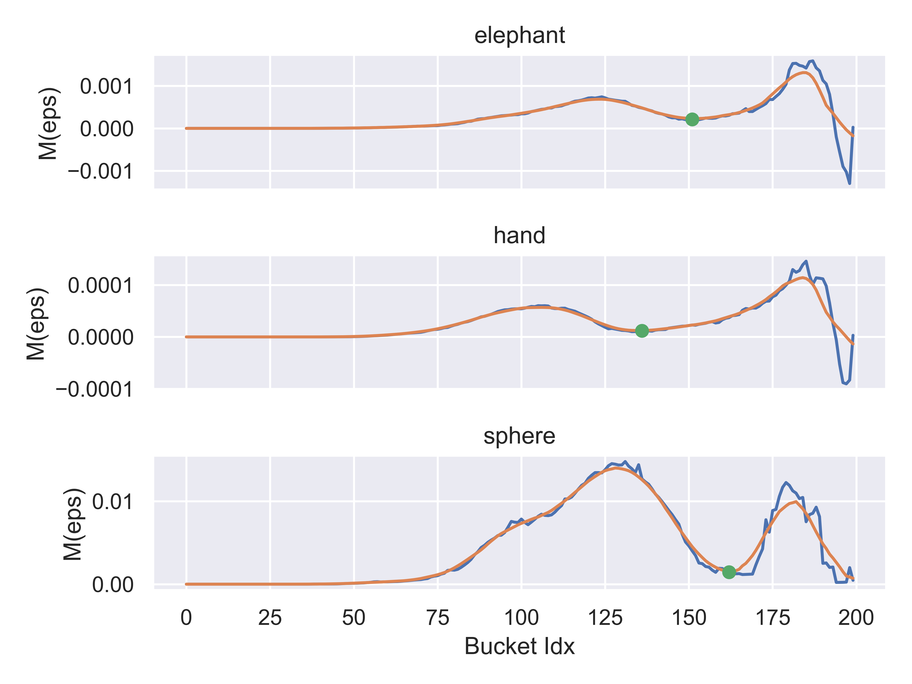

We also attach Figure 4 in the paper as reference.

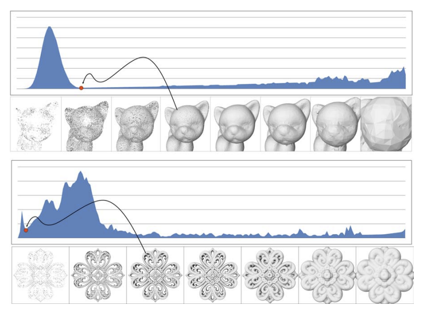

The image below shows an visualization of the raw point set, the coarse bounding
mesh from Delaunay triangulation, and the -band chosen based on the
auto-selected  values.

## -Band Refinement
Input points in the chosen -band are most likely to be close to the surface and
not noisy. Therefore, we can refine the unsigned distances of vertices within the band using
only input points inside the band. Instead of directly using the  nearest neighbors
inside the band, we now stochastically fit a plane with the neighbors. Specifically,
we take  random subsets of size . For each subset, we fit a plane with PCA and
computes the fitting residual as the mean point-to-plane distance in the subset.
We identify the best-fit plane as the one with the smallest residual, and 
set the refined unsigned distance as the distance between the plane and the query point
. The paper chooses  and .
The figure belows shows the histogram of absolute distance between the ground-truth unsigned
distance (esitamted with the mesh from Poisson Surface Reconstruct) and
the unsigned distance estimated before and after the refinement on the elephant point cloud.
Note that after refinement we do not see an improvement. We suspect this might be because
refinement aims to address noise in the input point cloud problem while the test
elephant point cloud is very clean.

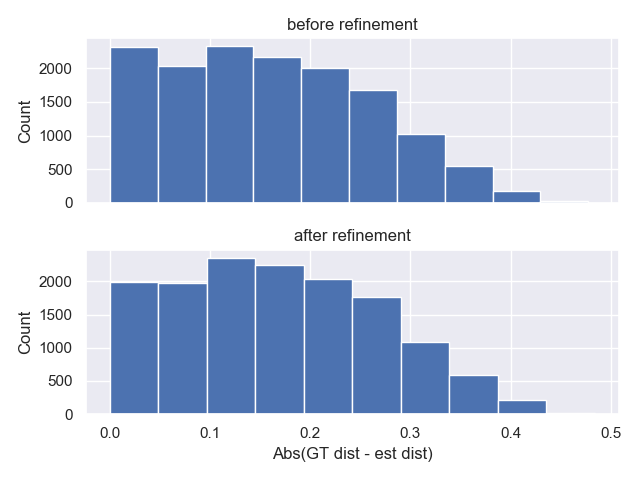

## Sign Estimates
We first preprocess a "graph-like" representation of the coarse mesh such that for any vertex , we have the edges connected to , a unit vector representing the direction of each edge, and the direction of the gradient of the unsigned distance at that vertex

    $$ \nabla d_U(x) \propto \frac{1}{K} \sum_{i=1}^K (x - x_i) $$

To "shoot rays", we sample a random unit vector `direc`, then choose the edge that most closely aligns with `direc` until we reach a vertex that was already visited. We shoot  rays from each vertex.

We count how many times each trajectory passes through the epsilon band by counting how many times the ray transitions from a vertex outside the band to a vertex inside the band and later departs from the band. As suggested in the paper, to somewhat filter out cases where a ray "grazes" the epsilon band and comes out the same side that it entered, we only count cases where the dot product of the gradient of the unsigned distance at the entrance point has a negative dot product with the gradient of the unsigned distance at the exit point.
* A ray shot from inside the elephant's belly intersects the epsilon band 3 times and is therefore correctly marked as an "interior" point. Entrances are colored green and exits are colored red.
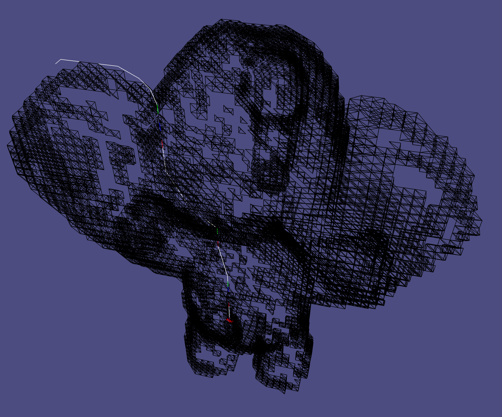
* Gradient of the unsigned distance. Since it roughly aligns with surface normals, the unsigned gradient is use to filter band-ray intersections in which the ray exits the same side of the band that it entered.
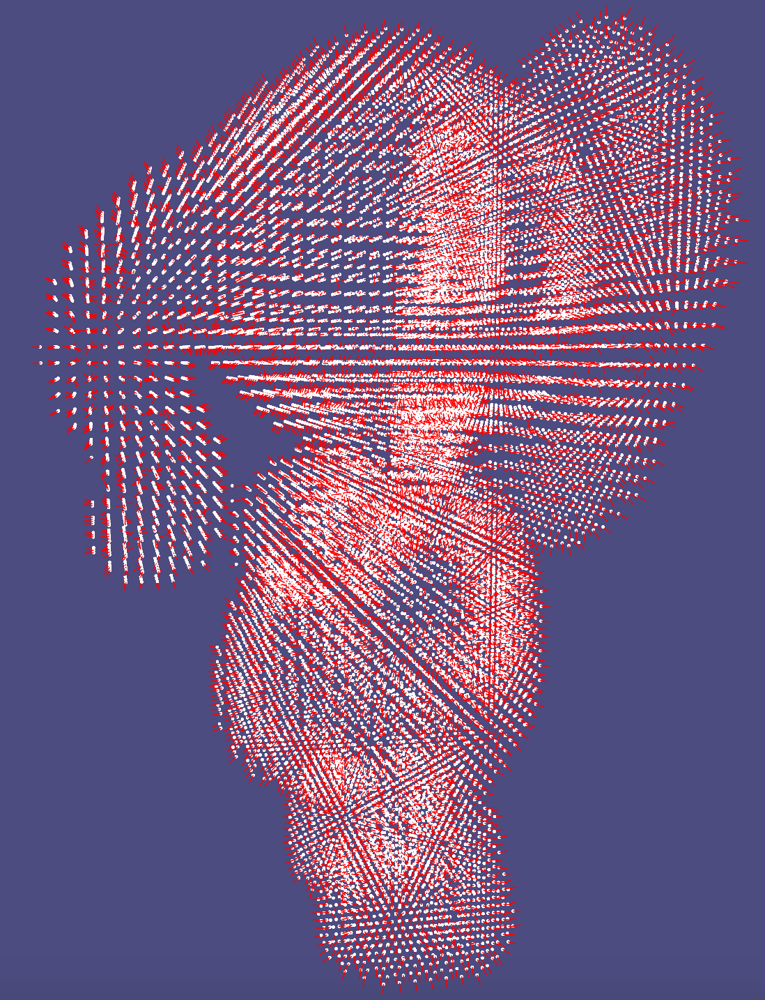
* An example where a ray "grazes" the epsilon band (black edges) and our algorithm (correctly) does not count it because the gradient of the unsigned distance at the entrance aligns too closely with the gradient at the exit. 
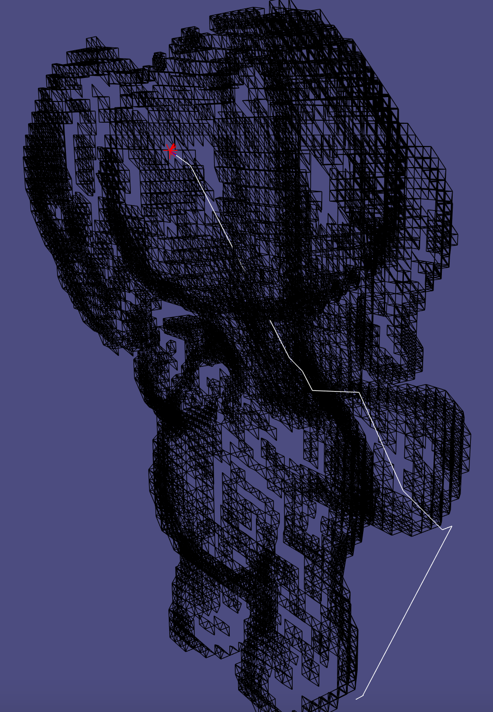
* Final predicted sign. Blue corresponds to "exterior" points, green corresponds to "band" points, and red corresponds to "interior" points.
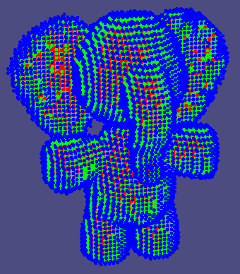
* Final "confidence" in the predicted sign. Dark corresponds to low confidence and bright corresponds to high confidence. The ears are regions of low confidence, which is intuitive because they are thin.
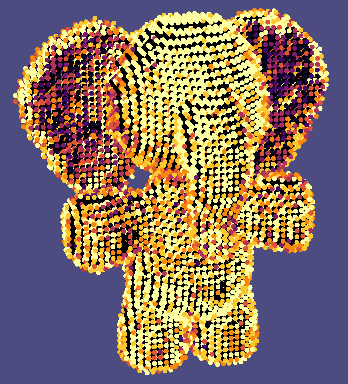

## Final Refinement
We now have unsigned distances for all vertices in the coarse mesh and we have an estimate of the sign of vertices outside the epsilon band (along with a measure of uncertainty in our estimate).
Before applying marching tetrahedra, the paper suggests that we first propagate sign estimates to the "band" vertices.

To so, we sort the band vertices by their unsigned distance. Starting with the vertex with greatest distance, we check all vertices that are connected to the current vertex that have been assigned a sign. If all neighbors have the same sign, we set the the sign of that vertex to the sign of its neighbors and set the confidence to the maximum of the confidence of its neighbors.

* Before and after sign propagation.
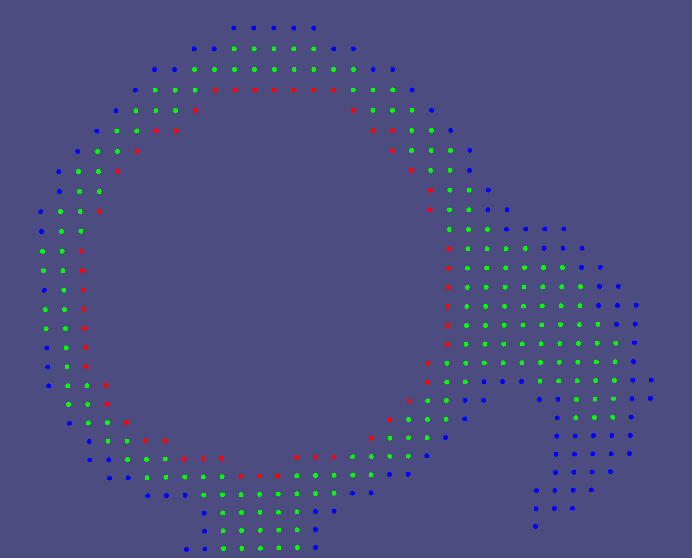
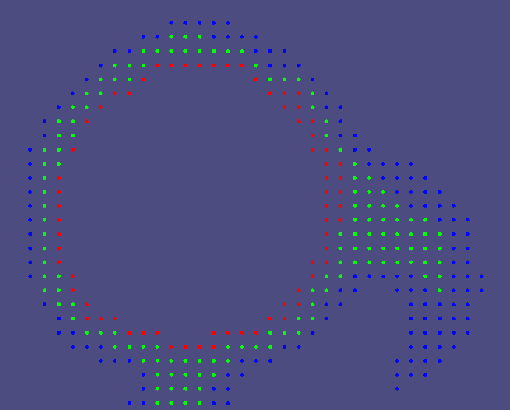

Before feeding our SDF to marching tets, we smooth the signed distances by solving the sparse linear system

where  is the laplacian of the coarse mesh,  is a scalar that controls how much smoothing we would like,  is a diagonal matrix holding the sign confidence,  is the smoothed signed distance that we solve for,  is a diagonal matrix containing the predicted sign, and  is the unsigned distance. Note that the larger alpha is, the more closely  will match . Large  therefore corresponds to no smoothing. We found  to work best.
* Smoothed signed distance

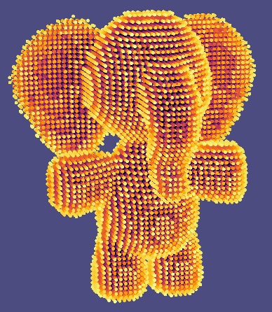

Finally, we apply marching tetrahedra to the smoothed signed distance on the coarse mesh to get a final triangle mesh.

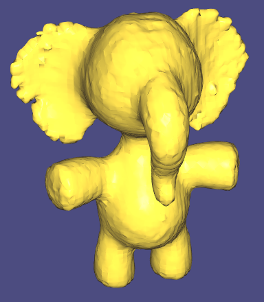

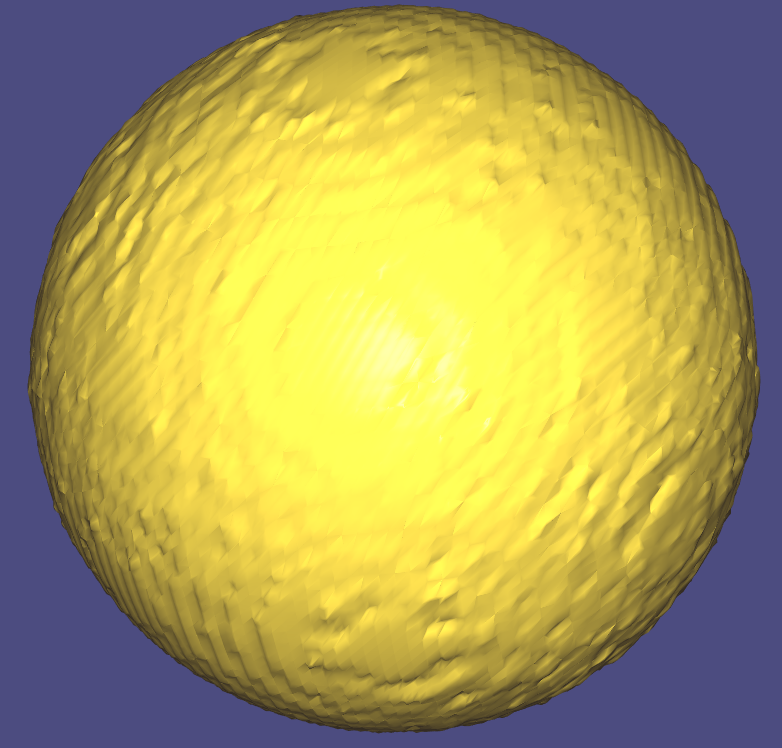

## Discussion
Empirically we found that the results are sensitive to four hyperparameters, which are
the hyperparameters associated with discretization density, the nearest neighbor ,
the number of rays used for sign esitmation, and the
smoothness hyperparametere .
In addition, the automatic -band selection heuristics might not give overall best
result even though the band visualization with the chosen  looks reasonable.
A follow-up work to this paper attempts to address this problem.
([Noise-Adaptive Shape Reconstruction from Raw Point Sets](http://citeseerx.ist.psu.edu/viewdoc/download?doi=10.1.1.679.2055&rep=rep1&type=pdf)). 